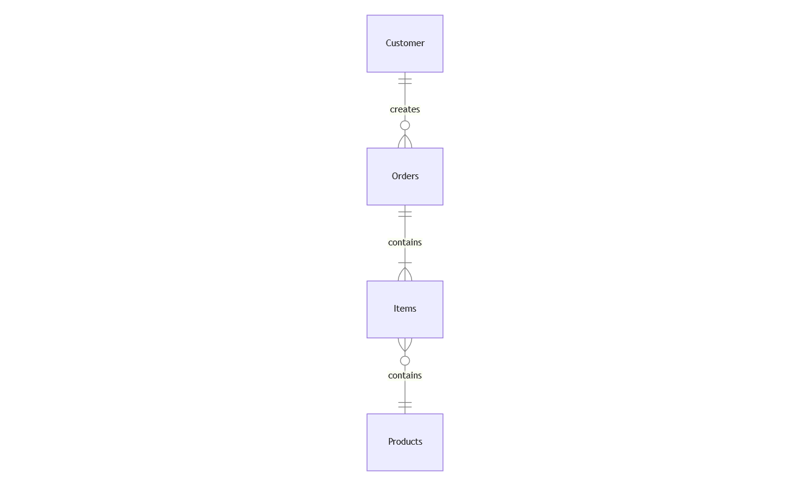

# Customer-Order-Rest-Api

A Rest API That implements Customer & Order CRUD functionalities. This project is written in C# 10 and .NET 6. I have used Clean Architecture & Domain Driven Design. I have also applied Entity Framework,Repository Pattern and Unit Of Work Pattern and CQRS pattern.


## Usage
The usage of this is to perform basic CRUD functionalities on Customers and Orders. You can ```Add``` / ```Update``` / ```Delete``` ```Customers```. A ```Customer``` can add ```Order``` and see the history of his ```Orders```.

## Domain Layer


The above Entity-Relationship Diagram describes the ```Entities``` in the ```Domain Layer``` and the ```Relationships``` between them.

CUSTOMER 
```C#
 public class Customer
 {
    [Key]
    public Guid Id { get; set; } = Guid.NewGuid();
    public string Name { get; set; } = null!;
    [Required]
    public string Email { get; set; } = null!;
    public string Password { get; set; } = null!;
    public string Address { get; set; } = null!;
    public string PostalCode { get; set; } = null!;
 }
```
ORDER
```C#
public class Order
{ 
    [Key]
    public Guid Id { get; set; } = Guid.NewGuid();

    [ForeignKey("Customer")]
    public Guid CustomerId { get; set; }

    public List<Guid> ItemIds { get; set; } = null!;

    public List<int> Quantity { get; set; } = null!;

    public float TotalCost { get; set; }

    public DateTime OrderDate { get; set; } = DateTime.Now;
}
```
ITEM
```C#
public class Item
{
    [Key]
    public Guid Id { get; set; } = Guid.NewGuid();

    public Guid OrderId { get; set; }

    public Product? Product { get; set; }

    public int Quantity { get; set; } = 0;
}
```
PRODUCT
```C#
public class Product
{
    [Key]   
    public Guid Id { get; set; } = Guid.NewGuid();

    public string Name { get; set; } = null!;

    public float Price { get; set; } = 0.0f;
}
```
## Database
I made an in memory implemetation. Everything, is saved in memory if you stop running the project all data will be lost.  

## Infrastracture Layer
In this layer all Repositories are implemented. This layer handles every connection to database and handles Insert, Read, Update, Delete.

## Application Layer
Handles the main logic of every endpoint. It does not have direct access to database it Implements all database functonalities through Repository Interfaces.

## Presentation Layer
In this layer controllers handle the endpoint requests and responses and call the appropriate handler in application layer. Responses and Request should respect some contracts. Those contracts are defined in the same Layer.

## Endpoints
By building and running the project, swagger will pop up. All the endpoints are visible there. You can use the example Requests to experiment with them.

- ```api/CreateCustomer```: Creates a Customer. If the email of the Customer exists already produces an error.

    Example Request:
    ```JSON
    {
        "firstName": "Alice",
        "lastName": "Smith",
        "email": "alice.smith@example.com",
        "password": "P@ssw0rd123",
        "address": "123 Main St",
        "postalCode": "12345"
    }
    ```

- ```api/UpdateCustomer```: Updates data of a Customer given his previous email.

    Example Request:
    ```JSON
    {
        "previousEmail": "alice.smith@example.com",
        "firstName": "Alice",
        "lastName": "Doe",
        "email": "alice.doe@example.com",
        "password": "NewPass123",
        "address": "123 Oak St",
        "postalCode": "54321"
    }
    ```

- ```api/DeleteCustomer```: Deletes Customer.

    Example Request:
    ```JSON
    {
        "email": "alice.doe@example.com",
        "password": "NewPass123"
    }
    ```

- ```api/CreateOrder```: Creates and Order given the name of the customer that creates the order a list of names of the products and a list of quantity for each of them.

    Example Request:
    ```JSON
    {
        "email": "alice.doe@example.com",
        "productNames": ["banana", "apple", "cherry"],
        "itemQuantity": [3, 2, 1]
    }
    ```

- ```api/CreateProduct```: Create Products based on a list of Names and a list of Price.

    Example Request:
    ```JSON
    {
        "productNames": [
            "banana",
            "apple",
            "cherry",
            "cucamber",
            "pineapple",
            "lemon"
        ],
        "prices": [
            2.0,
            4.0,
            5.7,
            1.0,
            4.0,
            2.7
        ]
    }
    ```

- ```api/GetCustomerOrderHistory```: Get all the Orders ordered by datetime from a Customer.

    Example Request
    ```JSON
    {
        "email": "alice.doe@example.com"
    }
    ```

## Further Implemetations

- Use MSSql RDBMS
- Dockerize Project and MSSql
- Create Unit Tests for every layer
- Create End-to-End tests.
- Create Integration tests.


